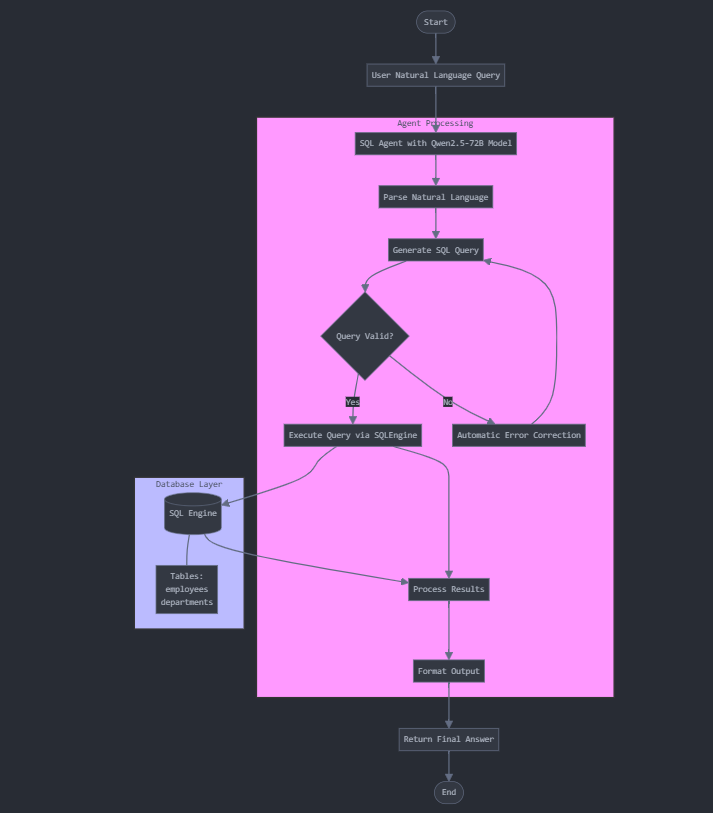

# Chat Assistant for SQLite Database

## Installation

Follow these steps to set up the project:

1. **Clone the Repository**: Run `git clone https://github.com/nihilisticneuralnet/Chat-Assistant-for-SQLite-Database.git` to clone the repository to your local machine.

2. **Install Dependencies**: Navigate to the project directory and install the required packages by running `cd <repository-directory>` followed by `pip install -r requirements.txt`. 

3. **Set Up Environment Variables**: In the `.env` file in the project root directory and insert your Gemini and Sarvam API keys as follows:
   ```plaintext
   HUGGINGFACE_TOKEN="your_huggingface_api"
   ```
   Replace `your_huggingface_api` with your actual API keys.

4. **Run the Application**: Finally, run the application using Streamlit by executing `python -m streamlit run app.py`.

Ensure you have all the necessary libraries installed before running these commands.


## Architecture Flow

 


## Output

 

